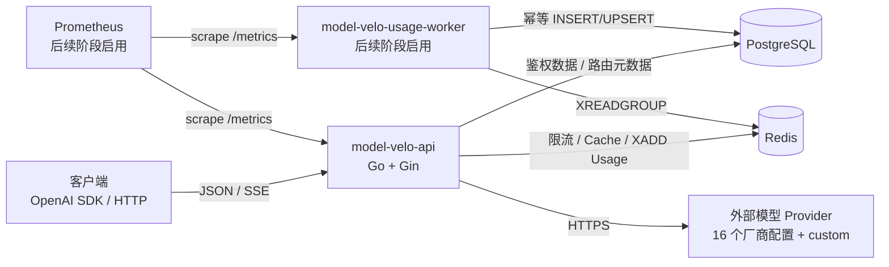
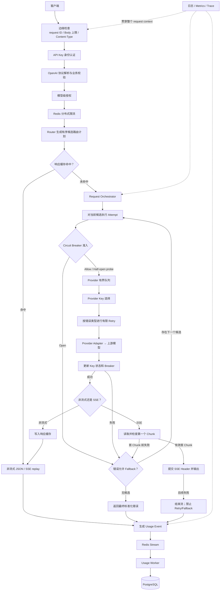
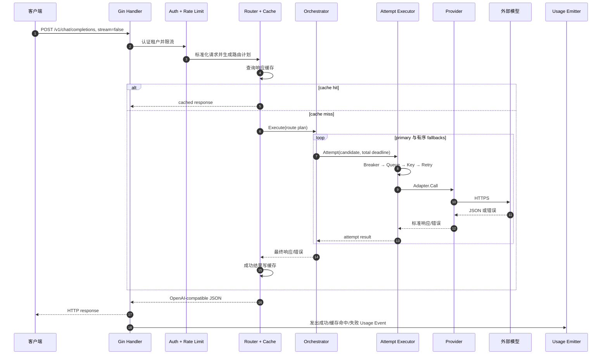
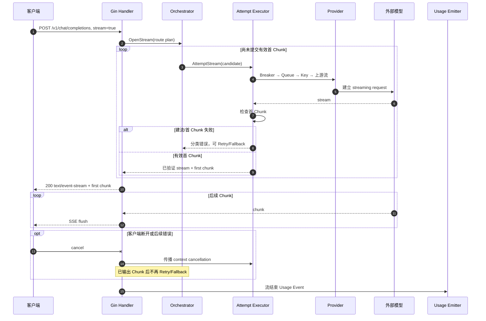
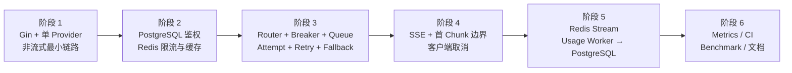

# Model-Velo 架构设计

> 状态：用户已明确授权开始阶段 3。阶段 2 的 PostgreSQL/Redis 生产链与真实依赖门禁已经完成，race 环境缺口仍保留。阶段 3 已接入有序 Route Plan、稳定错误分类、多 Provider Adapter/Breaker/Queue/Key Registry、单候选 Attempt Executor，以及共享总预算的有限 Retry 与有序 Fallback。

## 0. 当前实现边界

截至 2026-07-22，仓库中已经运行的是一条可在多个 Provider 之间有序 Fallback 的非流式请求链：

```text
HTTP Client
  -> Gin Router / request ID middleware
  -> Chat 请求大小、Content-Type 和最小字段校验
  -> Bearer 认证和租户模型授权
  -> Redis Lua 租户+模型限流
  -> Router 按精确规则或默认规则生成有序 Route Plan
  -> Redis Exact Cache 查询
  -> 命中直接返回；未命中由 Fallback Orchestrator 建立统一执行预算
  -> 按 Route Plan 顺序把当前候选交给 Attempt Executor
  -> Attempt 每次重新执行 Breaker 准入和 Provider Queue 有界等待
  -> Key Selector 选择可用 Key；5xx/网络重试优先保持原 Key
  -> 执行候选并映射上游模型，单次 HTTP 调用有独立期限
  -> 按结果反馈 Key/Breaker 并释放 Queue；允许时 Context-aware 退避后重试
  -> 候选最终失败且策略允许时进入下一候选；首个成功立即停止
  -> 完整成功 JSON 回填 Redis Cache
  -> Provider Adapter 按厂商协议转换请求并调用官方端点
  -> 兼容响应原样返回；原生响应归一化为 OpenAI Chat Completion
```

`cmd/model-velo` 负责环境变量、依赖装配、HTTP Server 和优雅关闭，`internal/httpapi` 负责传输协议，`internal/apikey` 负责认证授权，`internal/ratelimit` 负责 Redis 原子限流，`internal/routing` 负责纯内存有序路由计划，`internal/responsecache` 负责 Exact Cache Key 与读写，`internal/reliability` 负责 Orchestrator、Attempt Executor、安全 Failure、Retry Policy、时间预算以及按 Provider 隔离的 Breaker、Queue 和 Key 状态，`internal/provider` 负责 16 个厂商配置、Adapter Registry、协议转换和统一 HTTP 错误边界。当前还没有 SSE 或 Usage Worker。

启动配置没有隐式 Provider：`MODEL_VELO_ROUTING_JSON` 必须显式声明 Provider 与 Route，一个 Provider 也按相同格式配置；缺失或空白会在连接外部基础设施和监听 HTTP 前失败。生产 HTTP 装配只接受完整的 Adapter、Breaker、Queue、Key 与 Route Registry，不再保留单 Provider 快捷构造路径。

阶段 1 的全量测试、静态检查、异常矩阵和独立性检查已经通过；race detector 因本机缺少 GCC 尚未执行成功。用户已允许在保留该缺口的前提下继续。阶段 3 会先按请求所需的 `text`、`image`、`tools` 能力过滤 Route Plan，再在统一预算内按顺序执行候选：每个候选内部按 Provider ID 有限 Retry，401 永久停用无效 Key，403 只在当前请求内换 Key，429 优先换未冷却 Key；全部 Key 冷却时，只有最早恢复时间能放入剩余预算才在释放准入资源后等待；指定 5xx、网络和上游超时有界退避，每次调用重新进入 Breaker、Queue 和 Key 选择。候选耗尽后，普通 400 与取消停止，明确的模型不可用 4xx 等策略失败进入下一候选。VLM `text`/`image_url` 内容在兼容协议中原样透传，在 Anthropic、Gemini、Ollama 和 Bedrock 中显式转换；Adapter 明确不支持某种输入时只触发 Fallback，不 Retry、不计 Breaker，全部候选都不支持时返回明确 400。上游模型自身的实际模态能力仍由厂商响应决定。总预算取消和 race 仍留在阶段门禁。实际阶段 1 门禁证据见 `STAGE1_GATE.md`。

## 1. 项目定位

Model-Velo 是一个面向学习、实习求职展示和实际运行的轻量 LLM Gateway，技术栈固定为：

- Go + Gin：HTTP API；
- Redis：分布式限流、响应缓存、Usage Stream；
- PostgreSQL：API Key、Usage 和必要的持久化数据；
- OpenAI-compatible API：对客户端提供统一协议；
- 外部 Provider：通过统一 Adapter 契约接入厂商原生协议、厂商 OpenAI Chat 协议和自定义兼容端点。

项目采用“先完成最小纵向请求，再逐步增强”的方式，不在第一阶段搭建完整平台。

## 2. 参考来源与独立设计

只读参考：

- GoModel：本地 `D:\agent开源项目\GoModel-main\GoModel-main`，GitHub <https://github.com/ENTERPILOT/GoModel>
- Bifrost：本地 `D:\agent开源项目\bifrost-dev\bifrost-dev`，GitHub <https://github.com/maximhq/bifrost>

概念来源：

- 从 GoModel 借鉴显式分层、Provider Adapter、响应缓存、Circuit Breaker、错误分类 Fallback 和流式 observer 的思路。
- 从 Bifrost 借鉴 Provider Queue、Attempt Executor、Key 选择/轮换、有序 Fallback 和 SSE 首 Chunk 检查的思路。
- Model-Velo 自己确定 Gin 接入、Redis 分布式限流、Redis Stream Usage 管道、PostgreSQL 幂等落库以及具体包边界。

2026-07-22 只读核对 GoModel 的 `cmd/gomodel/main.go`、`internal/providers/init.go` 和 ADR-0001：它通过显式工厂注册选择可用 Provider，初始化后没有任何 Provider 会返回错误，而不是虚构一个兼容上游。Model-Velo 没有复制其注册结构，独立采用“显式路由 JSON + 启动失败”的配置边界。

这些是架构概念，不复制两个项目的代码、命名和目录。具体重合度约束见 `AGENTS.md`。

2026-07-18 使用 `modelmux-clone-check 1.0`，按连续至少 12 条非空逻辑行或 80 个 token 的阈值扫描 19 个生产 Go 文件、1763 条逻辑行，并排除测试、vendor、generated、UI 和示例。对 GoModel、Bifrost 及二者合并集的字面重复度和标识符归一化近似重复度均为 0.00%；人工复核也未发现相同独特命名、注释、错误文案或控制流。该结果只证明当前快照，不替代后续里程碑复查。

2026-07-21 在原生 Provider Adapter 切片后以同一工具和阈值复查 47 个生产 Go 文件、4892 条逻辑行：对 GoModel 的字面/近似重复度均为 0.00%；对 Bifrost 的字面重复度为 0.00%、近似重复度为 0.31%（15 行）；合并参考集为 0.00%/0.31%。人工复核本轮协议结构、错误文案和转换控制流未发现参考项目特有实现被复制。该结果仍只证明当前快照，阶段 3 总门禁保持未完成。

## 3. 运行时部署架构

下面是完整项目的目标部署图。当前已经启用 `Client -> API -> 多 Provider 有序 Fallback`、PostgreSQL 和 Redis；Worker 与 Prometheus 仍属于后续阶段。



运行时约束：

- 当前 `model-velo-api` 同时装配 PostgreSQL、Redis 和所有路由中声明的 Provider；每个 Provider 的 Adapter 与可靠性状态相互隔离。
- API 与 Worker 使用同一仓库、共享稳定的数据契约，但作为不同进程运行，避免 Usage 落库拖慢在线请求。
- Redis、PostgreSQL 都是外部组件，通过 Docker Compose 提供本地开发环境；生产部署细节不在早期阶段展开。

## 4. 核心请求架构



最重要的结构不是模块数量，而是两个闭环：

1. **Fallback 外层循环**：Orchestrator 选择候选；每个 primary 或 fallback 候选都重新进入完整的 Breaker、Queue、Key、Retry 和上游调用流程。
2. **Breaker 状态闭环**：调用前检查是否允许；调用后根据网络错误、5xx 或成功更新状态。Key 自身的 401/403/429 不应轻易熔断整个 Provider。

## 5. 模块职责边界

| 模块 | 负责 | 不负责 |
|---|---|---|
| HTTP Handler | Gin 路由、Body 上限、解码、HTTP/SSE 输出 | SQL、全局 Retry、Provider 选择 |
| Auth | Key 哈希校验、租户身份、模型权限 | 限流、Provider 凭证选择 |
| Rate Limiter | Redis 原子限流、返回剩余额度和 Retry-After | 业务路由、计费落库 |
| Protocol | OpenAI 请求/响应类型、校验、标准错误 | 直接调用外部 Provider |
| Router | 根据请求和配置生成有序候选列表 | 自己执行 HTTP Retry |
| Response Cache | 稳定 Cache Key、TTL、租户隔离、命中/回填 | 决定 Provider 是否健康 |
| Orchestrator | 依次运行候选 Attempt、控制总时间预算和 Fallback | 处理具体 Provider JSON 字段差异 |
| Attempt Executor | Breaker、Queue、Key、Retry 和一次候选调用 | 跨候选递归 Fallback |
| Provider Adapter | 上游请求转换、HTTP 调用、响应/错误转换 | 全局限流、数据库写入 |
| Usage Emitter | 将最终生命周期结果转换成稳定事件 | 阻塞执行复杂统计 SQL |
| Usage Worker | Redis consumer group、幂等落库、重试/认领 pending | 参与在线模型调用 |

早期实现可以让几个职责暂时位于同一包中，但不能把它们混进同一个巨大 Handler。只有出现第二个真实实现时才提取通用接口。

## 6. 非流式请求时序



## 7. SSE 请求时序



## 8. 错误分类和恢复策略

| 情况 | Retry | 换 Key | Fallback | Breaker |
|---|---|---|---|---|
| 本地解析/校验 400 | 否 | 否 | 否 | 不记录 Provider 失败 |
| Provider 能力不匹配 | 否 | 否 | 允许 | 不触发 |
| Provider 返回网关暂不能表达的输出 | 否 | 否 | 允许 | 不触发；最终映射为 502 |
| Provider 返回网关暂不能表达的输出 | 否 | 否 | 允许 | 不触发；最终映射为 502 |
| 上游普通 4xx | 否 | 否 | 否 | 不触发 |
| 模型不可用 400/404/422 | 否 | 否 | 允许 | 不触发 |
| 401 | 不使用原 Key 重试 | 有其他 Key 时可以 | Key 耗尽后按策略决定 | 永久停用 Key，不熔断 Provider |
| 403 | 当前请求不再使用原 Key | 有其他 Key 时可以 | Key 耗尽后按策略决定 | 不修改全局 Key 状态，不熔断 Provider |
| 429 | 尊重 `Retry-After`，受总预算限制 | 优先尝试未冷却 Key | Key 耗尽后允许 | 默认做 Key 冷却，不直接算 Provider 故障 |
| 500/502/503/504 | 有限次数 | 通常保持当前 Key | Retry 耗尽后允许 | 计入 Provider 失败 |
| 网络连接/超时 | 有限次数 | 通常保持当前 Key | Retry 耗尽后允许 | 计入 Provider 失败 |
| 畸形 2xx 协议响应 | 否 | 否 | 允许 | 计入 Provider 失败；网关主动大小限制除外 |
| 客户端取消 | 否 | 否 | 否 | 不把取消算作 Provider 故障 |
| SSE 首 Chunk 前错误 | 按上述类别 | 按上述类别 | 允许 | 按上述类别更新 |
| SSE 已输出 Chunk 后错误 | 否 | 否 | 否 | 根据真实上游错误更新 |

Retry 次数不是唯一约束：所有 Retry 和 Fallback 必须共享请求总 deadline，避免候选越多、响应时间越失控。

## 9. Redis 和 PostgreSQL 数据链路

### PostgreSQL Schema

- Model-Velo 当前统一使用 GORM，不在业务代码中直接调用 pgx，也不维护 `golang-migrate` runner 和手写 SQL migration；模块图中的 pgx 仅是 GORM 官方 PostgreSQL Dialector 的间接依赖。
- API 启动并 Ping 成功后执行 `AutoMigrate`，同步 `tenants`、`api_keys`、`tenant_model_grants`。
- 模型标签保留主键、唯一索引、查询索引、外键删除策略和必要的检查约束。
- `AutoMigrate` 不作为任意破坏性变更工具：删除列、改写存量数据或不兼容约束变更必须单独评审、备份并设计显式升级步骤。
- 当前没有 schema 版本回退命令；这是阶段 2 选择轻量 GORM 工作流后的明确边界。
- PostgreSQL 综合门禁使用显式测试 DSN 和随机 `model_velo_it_*` schema，重复执行 AutoMigrate 后检查表、索引、外键、检查约束及完整 API Key 生命周期，最后只删除该随机 schema；2026-07-18 已在 PostgreSQL 17.10 一次性容器真实通过并完成清理。

### API Key 存储与校验

- Key 使用 `mvl_<locator>_<secret>`，locator 和 secret 都来自 `crypto/rand`，完整明文只在创建时返回一次。由于 Base64URL 内容可以包含 `_`，解析按两个字段的固定编码长度定位分隔符，不能按所有下划线拆分。
- PostgreSQL 保存公开前缀、前缀 SHA-256、secret 的 HMAC-SHA-256 和哈希版本，不保存 secret 或完整 Key。
- HMAC Pepper 由 `MODEL_VELO_API_KEY_PEPPER` 提供，不写入数据库、日志或仓库；Pepper 变化会使已有 Key 无法通过校验。
- 查询先使用 locator 摘要命中唯一索引，再用常量时间比较验证 HMAC；未知 locator 与错误 secret 对外统一归类为无效凭证。
- 每次认证都从 PostgreSQL 检查 Key 状态、租户状态和 UTC 过期时间，因此禁用和吊销不依赖本地缓存过期；创建与认证共享同一到期边界，到期时刻本身即失效。
- `model-velo-admin` 负责租户初始化、Key 创建、禁用和吊销；永久吊销不可退回普通禁用。
- Gin 只保护 `/v1` 业务路由，`/healthz` 公开；认证成功后将最小身份写入 Go Context。
- Chat Handler 在请求结构校验后查询 `(tenant_id, gateway_model)`，未授权模型不会进入 Provider。
- 客户端 Model-Velo Key 不向 Provider 传播，Provider Adapter 继续只使用独立的上游凭证。

### 限流

- Redis 基础 Client 使用官方 `go-redis/v9`，显式配置地址、认证、DB、拨号/读写/池等待超时、池容量和最小空闲连接。
- 启动 `required/optional` 只控制首次 Ping 失败是否阻止 API 监听；运行时限流失败默认 fail-closed 返回 503，也可配置 fail-open 绕过并标记响应。
- 当前核心配额是每个环境、租户和规范化模型的固定窗口请求数；同租户下的多个 API Key 共享额度，未认证 IP 级保护不在本切片范围。
- Key 使用 `model-velo:rate-limit:v1:<environment>:tenant:<tenant_sha256>:model:<model_sha256>`，不包含原始 API Key、Provider Key 或原始模型名。
- Redis Lua 在一次原子执行中完成读取、首次计数、递增、TTL、服务端时间和决策返回；拒绝请求不递增、不续期，避免应用侧“先 GET 再 SET”的竞态。
- 允许/拒绝结果包含上限、剩余量和 Unix 秒重置时间；429 额外返回向上取整且至少为 1 秒的 `Retry-After`。
- 请求 Context 直接传入 go-redis 脚本调用；客户端取消不会被 fail-open 转换成放行。
- 真实 Redis 测试使用随机环境 namespace 定向清理；已验证窗口耗尽/恢复、租户/模型隔离，以及两个独立 Client 下 200 个并发请求竞争 25 个额度时恰好放行 25 个。race detector 仍因本机缺少 CGO/GCC 未完成。
- Provider 容量限流与客户端配额限流是两个概念：前者由每个进程内、每个 Provider 独立的有界 Queue 控制，后者由 Redis Rate Limiter 跨实例控制。

### 响应缓存

当前 Cache Key schema 为 `model-velo:response-cache:v1:<environment>:tenant:<tenant_sha256>:model:<model_sha256>:route:<route_version_sha256>:request:<canonical_request_sha256>`。整个请求 JSON 被递归规范化：对象字段排序，数组顺序和数字文本保留，缺失字段不与显式默认值合并，重复字段直接 bypass。原始 API Key、tenant、模型和提示词不进入 Key。

只缓存通过认证、授权和限流的非流式请求及其完整成功响应；`Cache-Control: no-store` 显式 bypass。缓存位于限流之后，因此命中也消耗配额。流中断、客户端取消、上游错误和非法响应不写缓存。缓存不可用时固定 fail-open，记录安全错误并继续上游；Context 取消仍直接传播。`HIT/MISS/BYPASS` 同时存在于内部结果和 HTTP Header，供后续 Usage 接入复用。

当前调用链为认证→授权→限流→按请求能力过滤 Route Plan→缓存→Fallback Orchestrator 建立 Provider 执行总预算→按序调用单候选 Attempt Executor。每次真正的上游调用都按 Provider ID 重新进入 Adapter/Breaker→Queue→Key Selector→厂商协议端点→Key/Breaker 反馈→Queue 释放；Queue、Breaker 或 Key 冷却等调用前准入等待不占用 `MaxAttempts`，只有策略允许时才在资源释放后用 Timer/select 退避。Chat 请求在 HTTP 边界只解析一次；兼容协议保留原始 JSON 和未知字段，原生协议在转换前明确拒绝无法表达的字段。Adapter Registry 根据路由显式声明的 `vendor`/`type` 构造实现：OpenAI、Mistral、DeepSeek、xAI、Zhipu、Groq、NVIDIA、Together 各自拥有厂商 Adapter，并复用它们共同采用的 OpenAI Chat wire codec 与 HTTP 安全边界；custom-compatible 使用独立的通用兼容 Adapter。Anthropic、Gemini、DashScope、Cohere、Ollama、Bedrock 和 Cloudflare 执行显式请求/响应转换，Azure 使用自己的 Endpoint 与 `api-key` 鉴权。Adapter 不保存默认 API Key，每次调用只接收 Key Selector 为本 attempt 选出的 Secret。Adapter 能力不匹配会跳过当前候选，不消耗 Retry、不污染 Breaker；401 永久停用无效 Key，403 仅在当前请求排除该 Key，429 按 `Retry-After` 冷却并优先选择其他 Key。网络、上游超时与 500/502/503/504 退避重试并优先保持原 Key；普通 4xx 停止，带安全错误码的模型不可用 400/404/422 允许 Fallback。兼容 2xx 必须满足 Chat 响应结构，原生输出无法表示时明确 Fallback；真正的畸形协议响应会计入 Provider Breaker。Fallback 成功结果不写 Exact Cache。全部 Retry 与 Fallback 共享一个请求总预算，Provider 可独立覆盖单次超时、重试、Breaker、Queue 和 HTTP 连接池；连接池默认跟随 Queue 并发上限。Attempt Trail 记录实际 Provider 调用的 Provider/模型/Key ID、序号、类别、状态码和耗时，不记录 Secret 或提示词，并在成功结果与最终 Failure 中保留，供后续 Usage 使用。Queue、Breaker 和 Key 状态都按 Provider ID 隔离；Queue 是进程内容量保护，多实例总容量由每实例配置相加，不提供分布式全局并发上限。总预算取消和 race 证据留在阶段门禁。

### Usage Stream

Usage Event 至少表达：唯一事件 ID、request ID、租户、请求模型、实际 Provider/模型、是否缓存命中、输入/输出 token、状态、错误分类、开始/结束时间和延迟。

可靠性语义是 **at-least-once**：

1. API 使用 `XADD` 写入 Redis Stream；
2. Worker 使用 consumer group 读取；
3. PostgreSQL 以事件 ID 唯一约束完成幂等 INSERT/UPSERT；
4. 数据库事务成功后再 `XACK`；
5. Worker 能处理 pending、重试和毒消息；
6. 不宣称 exactly-once。

## 10. 分阶段演进

### 快速交付原则

后续阶段优先形成可运行的生产纵向链，不以测试文件数量衡量工程质量。每个纵向功能只在安全、并发、持久化或协议边界选择最贴近风险的一层验证，通常最多维护一个合并测试文件；完整 race、真实依赖和故障矩阵集中到阶段收口执行一次。测试类 TODO 是证据槽位，不是独立开发里程碑，用户也不需要把测试代码作为学习主线。



每个阶段必须满足：

- 有可以运行的入口；
- 有自动化测试；
- 能演示正常链路和至少一个异常链路；
- 文档只描述已经实现的能力；
- 通过 `AGENTS.md` 规定的代码独立性检查；
- 用户确认后才进入下一阶段。

## 11. 第一阶段验收标准

开始写代码后的第一个里程碑只要求：

1. `GET /healthz` 返回稳定健康响应；
2. `POST /v1/chat/completions` 能校验最小 OpenAI Chat 请求；
3. 请求转发到一个可配置的 OpenAI-compatible 假上游或真实上游；
4. 正确返回非流式 JSON；
5. 上游超时、4xx、5xx 能转换成稳定错误；
6. request context 能取消上游请求；
7. 测试使用 `httptest.Server`，不需要 Redis、PostgreSQL 或付费 API；
8. `go test ./...` 和 `go vet ./...` 通过。

第一阶段完成后再引入 Redis 和 PostgreSQL，避免同时调试 HTTP 转发、数据库、缓存和并发控制。
