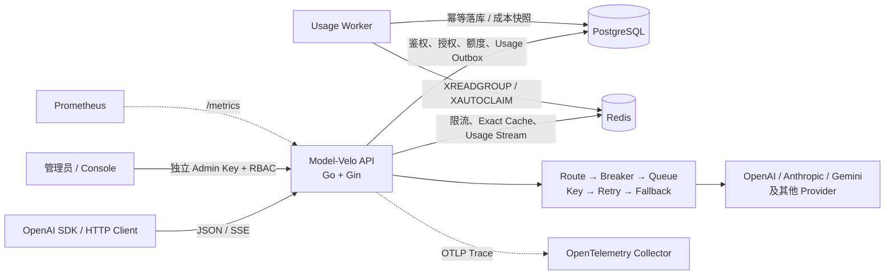

<div align="center">

# Model-Velo

**面向 OpenAI 生态的多协议 LLM Gateway**

用 Go 构建统一模型入口，把鉴权、路由、可靠性、缓存、限流和 Usage 计费收敛到一条可解释的请求链。

[](https://github.com/tonghzhang/Model-Velo/actions/workflows/ci.yml)
[](./go.mod)
[](https://github.com/gin-gonic/gin)
[](./compose.yaml)
[](./compose.yaml)

[快速开始](#快速开始) · [架构设计](./ARCHITECTURE.md) · [运维说明](./docs/operations.md) · [开发进度](./TODO.md)

</div>

> [!IMPORTANT]
> 当前阶段 5 的 Usage 生产链和非 race 门禁已完成，真实 Redis/PostgreSQL 集成已通过；Windows 本机因缺少可用 GCC，`go test -race` 尚未执行成功，因此本项目不宣称 race 已通过、生产就绪或 exactly-once。工程化代码已接入，但远端 CI、完整镜像构建和干净环境最终演示仍以门禁记录为准。

## 目录

- [项目简介](#项目简介)
- [核心能力](#核心能力)
- [系统架构](#系统架构)
- [支持的接口与 Provider](#支持的接口与-provider)
- [快速开始](#快速开始)
- [项目结构](#项目结构)
- [技术栈](#技术栈)
- [验证与完成度](#验证与完成度)
- [开发与贡献](#开发与贡献)
- [文档索引](#文档索引)
- [作者与许可](#作者与许可)
- [鸣谢](#鸣谢)

## 项目简介

Model-Velo 是一个使用 **Go、Gin、GORM、Redis 和 PostgreSQL** 实现的 OpenAI-compatible LLM 网关。客户端只接入一个稳定入口，网关负责把请求路由到不同模型厂商，并在统一的时间预算内完成鉴权、限流、缓存、Retry、Fallback、SSE 和 Usage 记录。

这个项目关注的不是“再包装一次模型 HTTP API”，而是模型请求进入生产系统后最容易出问题的部分：

- 多个 Provider 和多把上游 Key 如何选择、隔离与降级；
- 什么时候应该 Retry，什么时候应该换 Key 或 Fallback；
- SSE 首个有效 Chunk 前后为什么必须采用不同的恢复策略；
- Redis 故障、Worker 重启和重复投递时，Usage 如何可靠落库；
- 如何在不记录 Prompt、API Key Secret 的前提下提供可观测性和计费证据。

项目按纵向切片逐步演进，每个阶段都要求能够运行、测试和解释。GoModel 与 Bifrost 仅作为只读概念参考；Model-Velo 使用自己的包边界、数据结构、错误分类和测试实现。

## 核心能力

| 能力 | 当前实现 |
|---|---|
| 统一协议入口 | Chat Completions、Responses、Embeddings、Anthropic Messages 与模型查询接口 |
| 多 Provider 路由 | 精确模型与默认路由、有序候选、上游模型映射、按能力过滤 |
| 可靠性运行时 | Circuit Breaker、Provider 有界 Queue、多 Key 轮换、有限 Retry、有序 Fallback、统一总超时 |
| 流式响应 | OpenAI-compatible SSE；首 Chunk 前允许 Retry/Fallback，提交后禁止切换 Provider |
| 租户安全 | API Key 摘要/HMAC 存储、租户隔离、模型授权、独立管理员身份与 RBAC |
| 流量治理 | Redis Lua 分布式限流、租户隔离的 Exact Response Cache、PostgreSQL 额度预留与结算 |
| Usage 与成本 | Usage Event v2、详细 Token、TTFT、版本化价格、nanoUSD 成本快照、明细/汇总/时间序列查询 |
| 可靠投递 | PostgreSQL outbox、Redis Stream consumer group、`XAUTOCLAIM`、dead-letter、数据库幂等 |
| 工程诊断 | 结构化日志、健康/就绪探针、Prometheus、OpenTelemetry、非 root 容器与 CI 配置 |

### 关键设计边界

- **Fallback 在外层**：每个候选都重新进入 Breaker、Queue、Key 选择和 Retry，不复用上一个候选的运行时资源。
- **错误分类先于重试**：普通 400 不 Retry；401 停用当前错误 Key；403 只在当前请求排除该 Key；429 优先换 Key，并尊重 `Retry-After`；指定 5xx、网络失败和上游超时才有限重试。
- **SSE 以首 Chunk 为提交边界**：提交前可以安全换 Provider；向客户端输出后不再切换，避免拼接来自不同模型的响应。
- **Usage 是 at-least-once**：outbox 和 Redis Stream 允许重复投递，PostgreSQL 以唯一 `event_id` 幂等，不宣称 exactly-once。
- **Secret 不进入观测数据**：业务 API Key、Provider Key、Prompt 和完整模型响应不写入日志、指标或 Usage Event。

## 系统架构



一次非缓存请求的核心调用链：

```text
Request ID
  → API Key 认证
  → 租户模型授权
  → Redis 限流
  → Route Plan
  → 额度预留
  → Exact Cache
  → Fallback Orchestrator
      → Candidate Attempt
          → Circuit Breaker
          → Provider Queue
          → Provider Key
          → Retry
          → Provider Adapter
  → 响应 / SSE
  → Usage 固化与额度结算
```

认证和模型授权使用同一份版本化快照。请求先按现有
`lookup_digest` 查询有界 L1，再查询环境隔离的 Redis L2，最后才以
一条 Key/Tenant JOIN 和一条模型授权查询回源 PostgreSQL；命中 L1 或
L2 后不会再查询 `api_keys`、`tenants` 或
`tenant_model_grants`。快照保存 Key 的 HMAC 校验值但不保存明文 Key、
Pepper 或 Provider Secret，客户端 Secret 仍在每次请求中完成 HMAC
校验。

Key 状态和租户/模型授权管理变更会先删除本机与 Redis 缓存，再通过
Redis Pub/Sub 通知其他实例执行幂等删除。Pub/Sub 不是持久队列；消息
丢失时，默认 15 秒 L1 TTL 和 30 秒 L2 TTL 是最终失效上限。Redis
故障时 L1 miss 会安全回源 PostgreSQL，两个存储都不可用时认证
fail-closed。当前没有实现无效 Key 负缓存，避免新建 Key 在负缓存 TTL
内不可用。没有启用 Quota Policy 的租户和模型会由内存 Policy 索引
直接跳过 Reserve/Settle，不创建空事务。

认证缓存配置如下；Key 前缀和失效 Channel 默认包含
`MODEL_VELO_ENVIRONMENT`，不同环境不得复用命名空间：

| 环境变量 | 默认值 |
|---|---|
| `MODEL_VELO_AUTH_CACHE_ENABLED` | `true` |
| `MODEL_VELO_AUTH_CACHE_L1_MAX_ENTRIES` | `10000` |
| `MODEL_VELO_AUTH_CACHE_L1_TTL` | `15s` |
| `MODEL_VELO_AUTH_CACHE_L2_TTL` | `30s` |
| `MODEL_VELO_AUTH_CACHE_KEY_PREFIX` | `model-velo:<environment>:auth:v1` |
| `MODEL_VELO_AUTH_CACHE_INVALIDATION_CHANNEL` | `<key-prefix>:invalidate` |

更完整的部署图、时序图、包职责和错误恢复矩阵见 [ARCHITECTURE.md](./ARCHITECTURE.md)。

## 支持的接口与 Provider

### HTTP API

| 方法与路径 | 说明 | 认证 |
|---|---|---|
| `GET /healthz` | 进程存活检查 | 无 |
| `GET /readyz` | PostgreSQL 与 Redis 就绪检查 | 无 |
| `GET /metrics` | Prometheus 指标，可配置 Bearer Token | 可选独立 Token |
| `POST /v1/chat/completions` | OpenAI Chat，支持非流式与 SSE | 业务 API Key |
| `POST /v1/responses` | OpenAI Responses 兼容入口 | 业务 API Key |
| `POST /v1/embeddings` | Embeddings 入口 | 业务 API Key |
| `POST /v1/messages` | Anthropic Messages 兼容入口 | 业务 API Key |
| `GET /v1/models` | 当前 Key 可用模型 | 业务 API Key |
| `GET /v1/usage/*` | Usage 明细、汇总与时间序列 | 业务 API Key |
| `/admin/v1/*` | Runtime、价格、租户、Key、额度、管理员与审计 | Admin Key + RBAC |

### Provider

内置厂商装配支持：

| 协议类型 | Provider |
|---|---|
| OpenAI Chat wire | OpenAI、Azure OpenAI、Mistral、DeepSeek、xAI、Zhipu、Groq、NVIDIA、Together、Cloudflare |
| 厂商原生协议 | Anthropic、Gemini、DashScope、Cohere、Ollama、Amazon Bedrock |
| 自定义接入 | 任意显式配置 `base_url` 的 OpenAI-compatible 上游 |

Provider 和模型清单由配置显式声明，代码不会硬编码容易过期的模型版本。图片、音频、文件、Tools 和结构化输出还必须同时满足目标协议与具体模型声明的能力。

## 快速开始

下面使用仓库内置的确定性假上游，不调用真实模型或付费 API。

### 开发前的配置要求

- [Git](https://git-scm.com/)
- [Go 1.26+](https://go.dev/)
- [Docker Desktop](https://www.docker.com/products/docker-desktop/) 与 Docker Compose
- 可选：[Node.js](https://nodejs.org/) 与 npm，用于运行 Vue 控制台

### 1. 克隆仓库

```powershell
git clone https://github.com/tonghzhang/Model-Velo.git
Set-Location Model-Velo
```

### 2. 准备环境变量

```powershell
Copy-Item .env.example .env
```

至少替换以下内容：

- PostgreSQL 与 Redis 本地密码；
- `MODEL_VELO_API_KEY_PEPPER`；
- 与业务 Pepper 不同的 `MODEL_VELO_ADMIN_KEY_PEPPER`；
- Base64 编码的 32 字节 `MODEL_VELO_CONTROL_MASTER_KEY`；
- `MODEL_VELO_METRICS_TOKEN`；
- Provider 路由和 Provider Key。

可以用 OpenSSL 分别生成两个 Pepper、控制面主密钥和 Metrics Token：

```powershell
openssl rand -base64 48
openssl rand -base64 48
openssl rand -base64 32
openssl rand -base64 48
```

为了连接本机假上游，把 `.env` 中的两项 Provider 配置改为：

```dotenv
MODEL_VELO_PROVIDER_KEYS_JSON={"providers":[{"provider_id":"local-mock","keys":[{"id":"test","secret":"not-a-real-provider-key"}]}]}
MODEL_VELO_ROUTING_JSON={"providers":[{"id":"local-mock","type":"openai-compatible","vendor":"custom","base_url":"http://host.docker.internal:9000","models":["*"],"model_capabilities":{"*":["text"]}}],"routes":[{"model":"*","candidates":[{"provider":"local-mock"}]}]}
```

`.env` 由 Docker Compose 读取；直接执行 `go run` 时，程序不会自动加载该文件。

### 3. 启动假上游与网关

在第一个终端启动假上游：

```powershell
go run ./test/fakeupstream -addr 0.0.0.0:9000 -name local
```

它没有管理鉴权，只应在本地或受保护的测试网络中运行。

在第二个终端构建并启动网关、Usage Worker、PostgreSQL 和 Redis：

```powershell
docker compose up --build -d gateway usage-worker
docker compose ps
```

服务正常时，`gateway`、`usage-worker`、`postgres` 和 `redis` 应处于运行或健康状态：

```powershell
Invoke-RestMethod http://localhost:8080/healthz
Invoke-RestMethod http://localhost:8080/readyz
```

### 4. 创建租户和业务 API Key

```powershell
docker compose --profile tools run --rm admin bootstrap-tenant `
  --slug demo `
  --name "Demo Tenant" `
  --label "local development" `
  --models "mock/instant"
```

命令输出的 `api_key` 只出现一次，请立即保存。数据库只保存定位摘要和 HMAC，不保存可恢复的完整明文 Key。

### 5. 调用 Chat Completions

```powershell
$modelVeloKey = "替换为刚刚创建的 mvl_... Key"
$headers = @{
  Authorization = "Bearer $modelVeloKey"
  "Content-Type" = "application/json"
}
$body = @{
  model = "mock/instant"
  messages = @(
    @{ role = "user"; content = "Hello, Model-Velo" }
  )
} | ConvertTo-Json -Depth 5

Invoke-RestMethod `
  -Method Post `
  -Uri "http://localhost:8080/v1/chat/completions" `
  -Headers $headers `
  -Body $body
```

OpenAI Python SDK 只需替换 `base_url` 和 API Key：

```python
import os
from openai import OpenAI

client = OpenAI(
    api_key=os.environ["MODEL_VELO_CLIENT_KEY"],
    base_url="http://localhost:8080/v1",
)

response = client.chat.completions.create(
    model="mock/instant",
    messages=[{"role": "user", "content": "Hello, Model-Velo"}],
)
print(response.choices[0].message.content)
```

### 6. 停止环境

```powershell
docker compose down
```

该命令保留 PostgreSQL 和 Redis 数据卷。只有确认不再需要本地数据时，才使用 `docker compose down --volumes`。

### 可选：启动控制台

```powershell
Set-Location frontend
npm install
npm run dev
```

默认访问 `http://127.0.0.1:4173`。控制台的角色边界、代理配置和当前交互范围见 [frontend/README.md](./frontend/README.md)。

## 项目结构

```text
Model-Velo/
├── cmd/
│   ├── model-velo/                 # 网关 API
│   ├── model-velo-admin/           # 租户、Key、管理员和成本维护命令
│   ├── model-velo-healthcheck/     # 容器健康检查
│   └── model-velo-usage-worker/    # Usage 消费与落库进程
├── internal/
│   ├── httpapi/                    # Gin 路由、协议边界与 HTTP 输出
│   ├── provider/                   # Provider Adapter 与协议转换
│   ├── routing/                    # 有序 Route Plan
│   ├── reliability/                # Breaker、Queue、Key、Retry、Fallback
│   ├── apikey/                     # 业务 API Key 与租户授权
│   ├── adminauth/                  # 管理员身份与 RBAC
│   ├── controlplane/               # 版本化 Runtime、价格与审计
│   ├── quota/                      # 额度预留与结算
│   ├── usage/                      # Event、outbox、Stream、成本与查询
│   ├── responsecache/              # Redis Exact Response Cache
│   ├── ratelimit/                  # Redis Lua 分布式限流
│   ├── postgres/                   # GORM 模型、连接与 AutoMigrate
│   └── observability/              # 日志、Metrics 与 Trace
├── frontend/                       # Vue 3 控制台
├── docs/                           # 运维、benchmark、假上游等专题文档
├── test/                           # 假上游、k6、SSE 与多机测试工具
├── .github/workflows/ci.yml        # GitHub Actions
├── compose.yaml                    # 本地完整运行环境
├── Dockerfile                      # 多阶段非 root 镜像
├── ARCHITECTURE.md                 # 架构设计
└── TODO.md                         # 分阶段进度与证据
```

## 技术栈

| 分类 | 技术 |
|---|---|
| 后端 | Go 1.26、Gin |
| 数据访问 | GORM、PostgreSQL 17 |
| 缓存与消息 | Redis 8、go-redis/v9、Redis Lua、Redis Stream |
| 可靠性 | Context deadline/cancellation、Circuit Breaker、Bounded Queue、Retry、Fallback |
| 可观测性 | slog、Prometheus、OpenTelemetry |
| 前端 | Vue 3、TypeScript、Vite、ECharts、Tailwind CSS |
| 工程化 | Docker Compose、distroless non-root image、GitHub Actions、k6 |

## 验证与完成度

| 范围 | 当前状态 |
|---|---|
| 阶段 1：最小非流式网关 | 已完成并保留门禁记录 |
| 阶段 2：PostgreSQL 鉴权、Redis 限流与缓存 | 生产链已实现 |
| 阶段 3：路由与可靠性 | 生产功能、合并故障矩阵、全量测试与独立性检查已完成；race 仍受本机工具链限制 |
| 阶段 4：SSE | 生产边界与非 race 门禁已完成；首 Chunk 提交规则已有测试证据 |
| 阶段 5：Usage 数据链路 | Usage v2、真实 Redis/PostgreSQL 集成与非 race 门禁已完成；最终 race 门禁待补 |
| 工程化能力 | 日志、Metrics、Trace、CI、容器和 benchmark 工具已存在；不等于远端门禁和生产容量已经证明 |

阶段 5 使用 PostgreSQL outbox、Redis Stream 和数据库唯一键实现 **at-least-once + 幂等落库**。未知价格保持 `NULL`，不会伪造零成本；benchmark 只描述指定环境和负载，不能外推为生产 QPS。

日常检查：

```powershell
gofmt -l .
go test ./...
go vet ./...
go build ./cmd/...
```

真实 Redis/PostgreSQL 测试只在显式提供测试环境变量时运行；跳过不等于通过。完整证据和当前缺口见：

- [阶段 1 门禁](./STAGE1_GATE.md)
- [阶段 3 门禁](./STAGE3_GATE.md)
- [阶段 4 门禁](./STAGE4_GATE.md)
- [阶段 5 门禁](./STAGE5_GATE.md)
- [工程化门禁记录](./STAGE6_GATE.md)

## 开发与贡献

本项目当前采用小步纵向切片：

1. 先写目标、非目标与验收条件；
2. 只修改当前功能必需的文件；
3. 优先完成最小生产调用链；
4. 在安全、并发、持久化和外部协议边界补关键测试；
5. 运行格式、全量测试和静态检查；
6. 记录实际证据与未覆盖边界，再进入下一里程碑。

提交信息使用 Conventional Commits，例如：

```text
feat(gateway): add non-stream chat proxy
fix(usage): preserve pending event on database failure
docs(readme): add local quick start
```

参与开发前请先阅读 [AGENTS.md](./AGENTS.md)。建议从 [TODO.md](./TODO.md) 中已经授权的当前阶段选择一个纵向切片，不要绕过门禁提前扩展下一阶段。

## 文档索引

| 文档 | 内容 |
|---|---|
| [ARCHITECTURE.md](./ARCHITECTURE.md) | 架构边界、时序、模块职责与错误策略 |
| [docs/detailed-reference.md](./docs/detailed-reference.md) | 完整环境变量、协议约束与实现细节 |
| [docs/operations.md](./docs/operations.md) | 启动顺序、探针、安全边界与故障恢复 |
| [docs/fake-upstream.md](./docs/fake-upstream.md) | 可编程假上游与可靠性场景 |
| [docs/benchmark.md](./docs/benchmark.md) | 可复现 benchmark 方法、环境与边界 |
| [test/threehost/README.md](./test/threehost/README.md) | 三机负载与故障演示 |
| [frontend/README.md](./frontend/README.md) | Vue 控制台启动与权限边界 |

## 作者与许可

维护者：[@tonghzhang](https://github.com/tonghzhang)

仓库当前未提供 `LICENSE` 文件。在许可证正式补充前，请不要默认将本项目视为 MIT 或其他开源许可证；如需复用、分发或接受外部贡献，应先明确授权范围。

## 鸣谢

- [GoModel](https://github.com/ENTERPILOT/GoModel)：显式分层、Provider 能力、缓存和可靠性相关概念参考。
- [Bifrost](https://github.com/maximhq/bifrost)：Provider Queue、Attempt、Key 选择、有序 Fallback 和 SSE 首 Chunk 概念参考。
- [Best README Template](https://github.com/shaojintian/Best_README_template)：README 章节骨架参考。

Model-Velo 仅学习通用架构思想，生产代码、测试、配置结构、错误文案和目录边界均独立实现。
